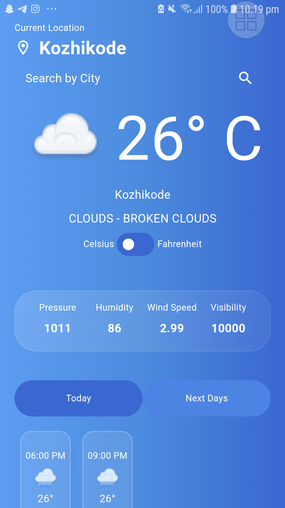

# Flutter Weather App  
This is a weather app built with Flutter that fetches real-time weather data for the user's location. The app features a sleek, visually appealing user interface, provides weather details, and allows users to switch between Celsius and Fahrenheit. Additionally, it displays a forecast for the next three days, as well as current weather conditions such as temperature, weather description, wind speed, and humidity.  

## Features  
- Current Weather: Displays the current temperature, weather description, wind speed, humidity, and other details.  
- 3-Day Forecast: Shows the weather forecast for the next 3 days (This feature is currently under development).  
- Unit Conversion: Users can switch between Celsius and Fahrenheit.  
- Location Services: Automatically fetches the user's location to display the weather for their area.  
- Manual Location Entry: Users can manually enter a location (optional).  
## How to Run the App  
### Prerequisites  
- Flutter SDK installed on your machine.  
- An IDE like Android Studio or VS Code with Flutter and Dart plugins.  
- API Key for the weather data provider (OpenWeatherMap/Weather API).  
### Setup   
- Clone the repository:
`git clone https://github.com/haadiyaa/weatherapp_test.git`
- Navigate to the project directory:
`cd flutter-weather-app`
- Install dependencies:
`flutter pub get  `
- Add your API key to the appropriate file (e.g., in the lib/services/weather_service.dart):
`const String apiKey = 'YOUR_API_KEY';`
- Run the app on your device:
`flutter run  `
### Screenshots  

### Dependencies:
- Flutter
- Dart
- OpenWeatherMap API 
- Geaolocator and Geocoding
- BLoC State Management

### Weather API
This app uses OpenWeatherMap API. Make sure to sign up and get your API key to fetch weather data.  

### APK File
You can download the .apk file [here]().  

